<h1>
  Master Tennis App
  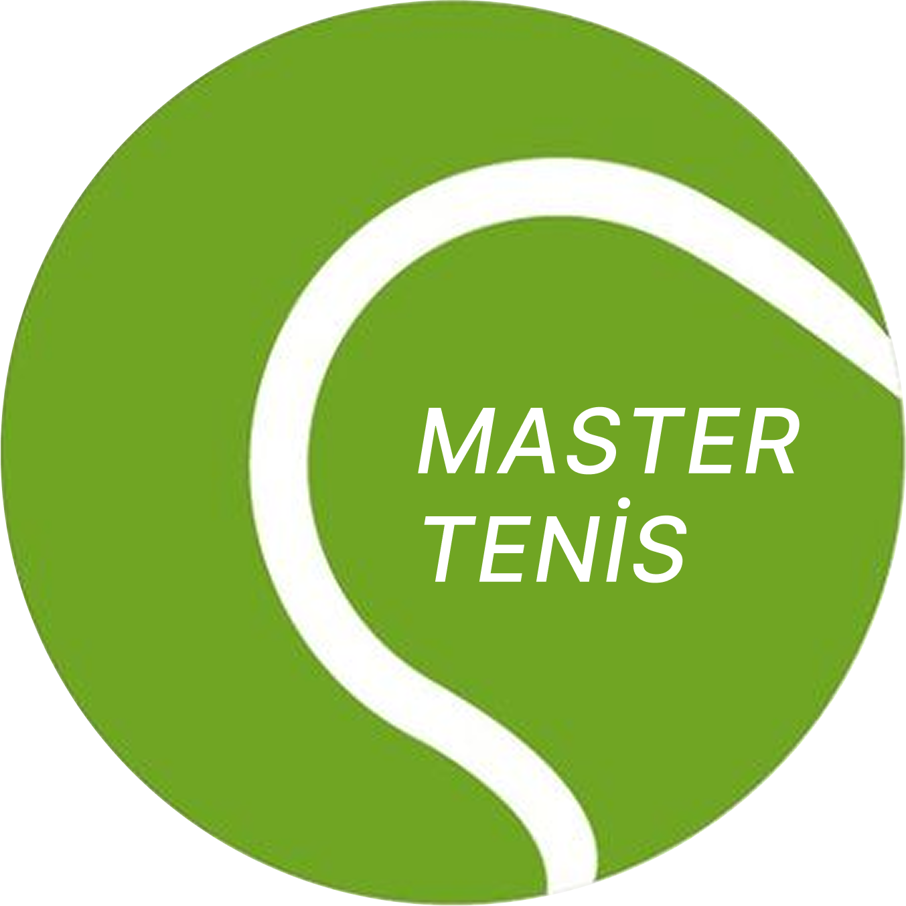
</h1>

MasterTennisApp is a dedicated **desktop application** designed exclusively for tennis players.  
Multiple users can use the same application by creating their own profiles, making it ideal for shared environments or family computers.  
Players using this app can create and manage organizations, and then set up new tournaments within those organizations. The app showcases earned medals and trophies, provides countdowns for upcoming matches, displays all match records for tournaments, and enables players to search and explore features from past tournaments, such as played opponents, maximum achieved stages, and tournament seasons.

## Table of Contents

- [Features](#features)
- [Getting Started](#getting-started)
- [Installation](#installation)
- [Usage](#usage)
- [Folder Structure](#folder-structure)
- [License](#license)
- [Contact](#contact)

---

## Features

- **Multiple User Support:** Multiple users can use the same desktop application by creating their own profiles.
- **Organization Management:** Tennis players can create and manage organizations.
- **Tournament Creation:** Players can create new tournaments within their saved organizations.
- **Awards Tracking:** Medals and trophies earned are displayed to users.
- **Upcoming Matches Countdown:** Live countdowns are shown for upcoming matches.
- **Tournament Match Records:** All match records for tournaments are shown to users.
- **Statistics:** Users can view personalized career statistics, including the number of played finals, semi-finals, quarter-finals, total wins and losses, performance percentages, and more.
- **Past Tournament Feature Search:** Players can search specific features from past tournaments, such as played opponents, maximum achieved stages, and tournament seasons.
- **Profile Switching:** Users can switch to other profiles directly from their profile screen, without returning to the welcome screen.
- **Profile & Organization Pictures:** Users can provide and manage profile pictures and organization images (with dedicated folders for each).

---

## Getting Started

To get a local copy up and running, follow these steps:

### Prerequisites

- **Qt 6.7.0** (must be installed on your system)
- **CMake** (for building the project)
- **C++20** compatible compiler (e.g., GCC, Clang, MSVC)
- **SQLite** (the database is embedded; no separate installation needed)

---

## Installation

1. Clone the repository:
    ```bash
    git clone --recursive https://github.com/KadirEmreAVCI/MasterTennisApp.git
    cd MasterTennisApp
    ```
2. Make sure Qt 6.7.0 is installed and available in your PATH.
3. Build the project using CMake:
    ```bash
    cmake -S . -B build
    cmake --build build
    ```
4. After a successful build, the executable `MasterTennisApp.exe` will be located in either the `build/debug` or `build/release` folder, depending on the build configuration you selected.

---

## Usage

### Welcome Screen

Click **Start** button to create, edit, or delete player profiles, and to log in to a selected profile.  
Click **Manage** button to add, edit, or delete organizations. Note that organizations are shared across all profiles.

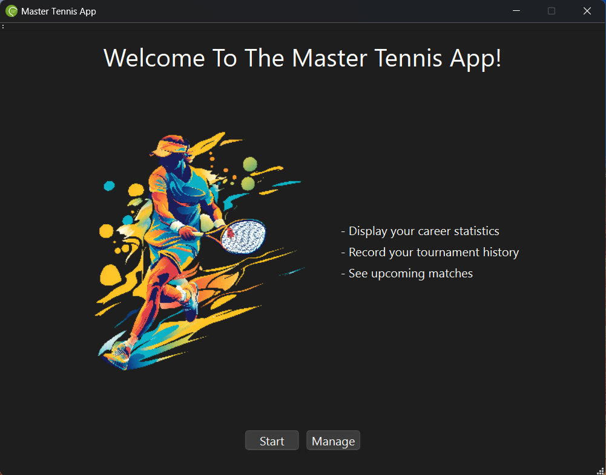

### Profile Management

Edit your profile details, upload a profile picture, or switch profiles.

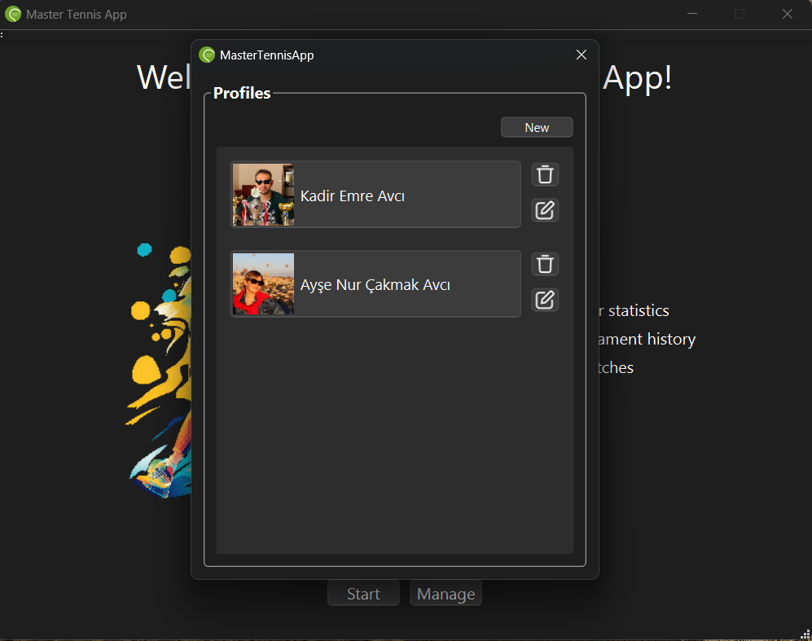

### Organization Management

Create and manage organizations, upload organization images, and view details.

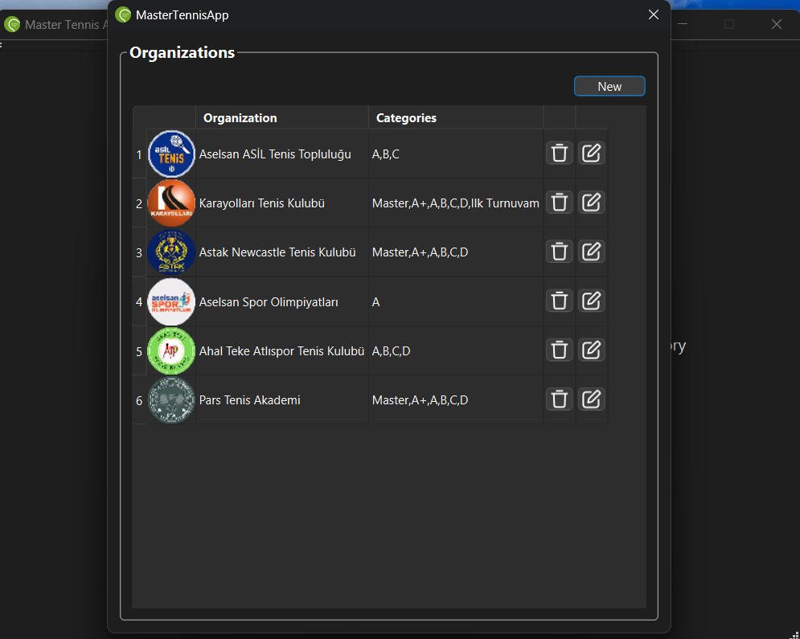

### Home Page

The **Home Page** exists for each user and displays upcoming matches as well as participation numbers in organizations.

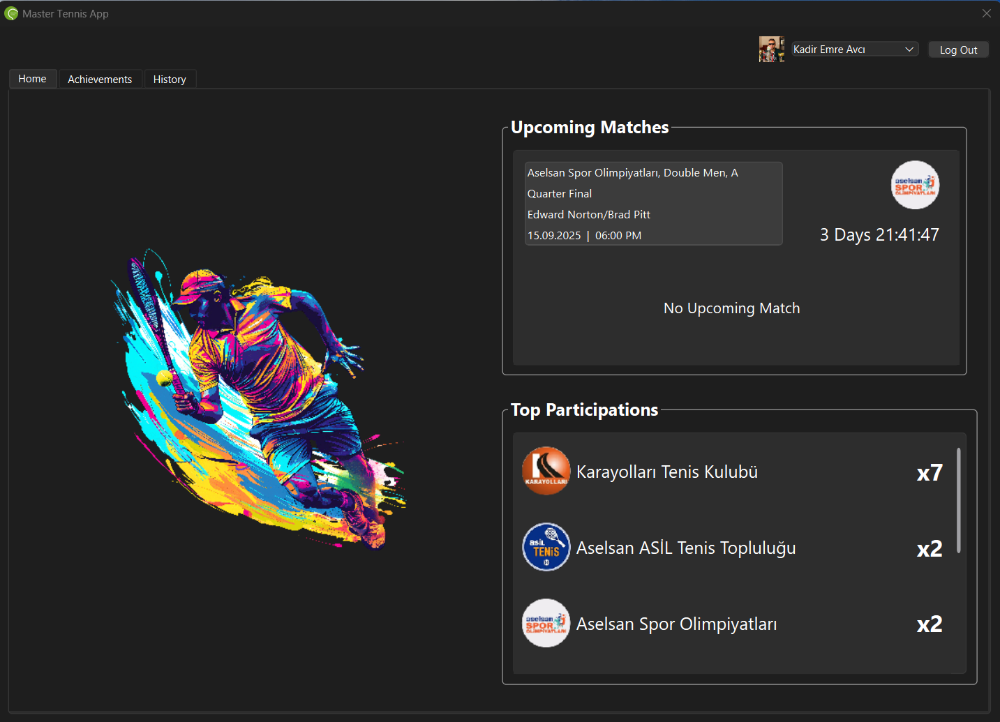

### Achievements View

View your personalized career statistics, including the number of played finals, semi-finals, quarter-finals, total wins and losses and performance percentages, as well as medals and trophies.

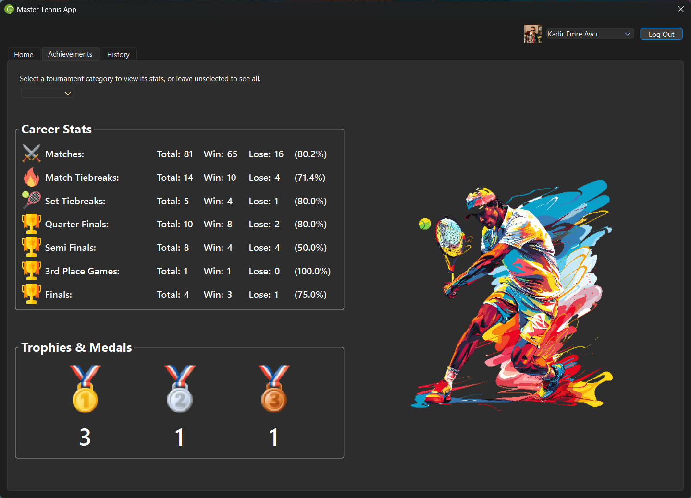

Filter your career stats by tournament category, type, or organization for deeper insights.

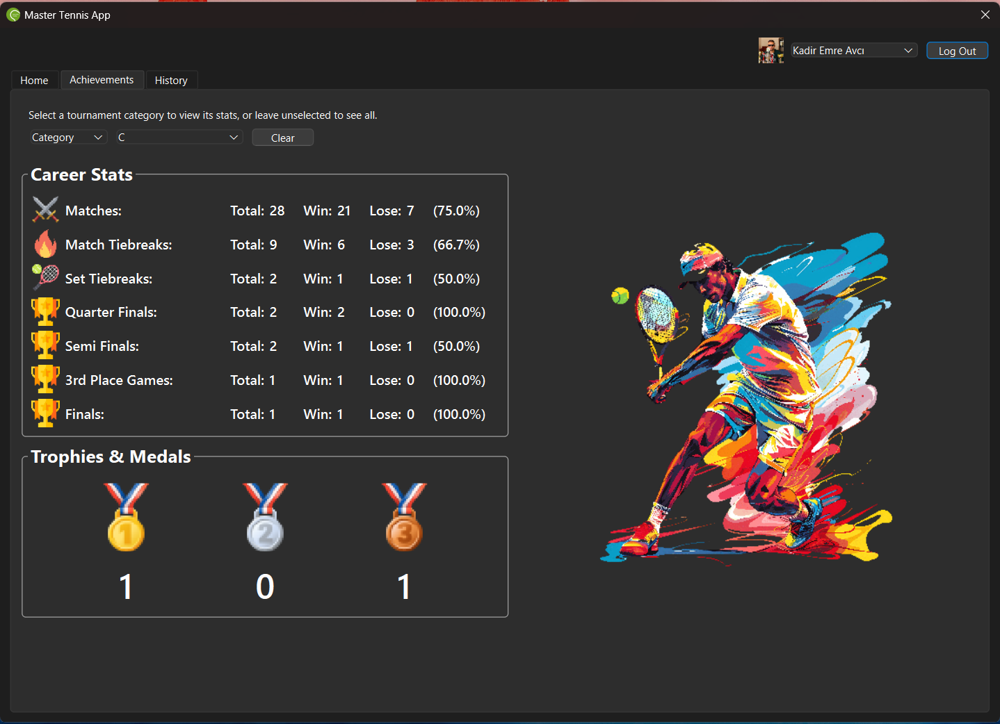

### Tournament Records

Browse past tournaments, view all match records for tournaments you participate in, and search for details like played opponents, max stages reached, and seasons.

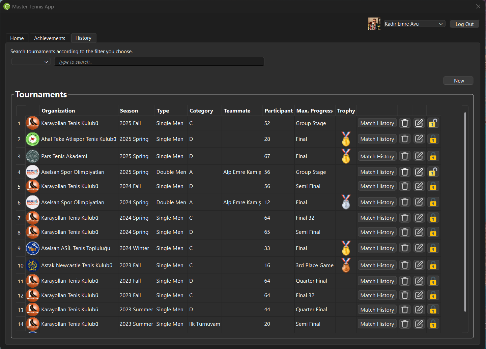

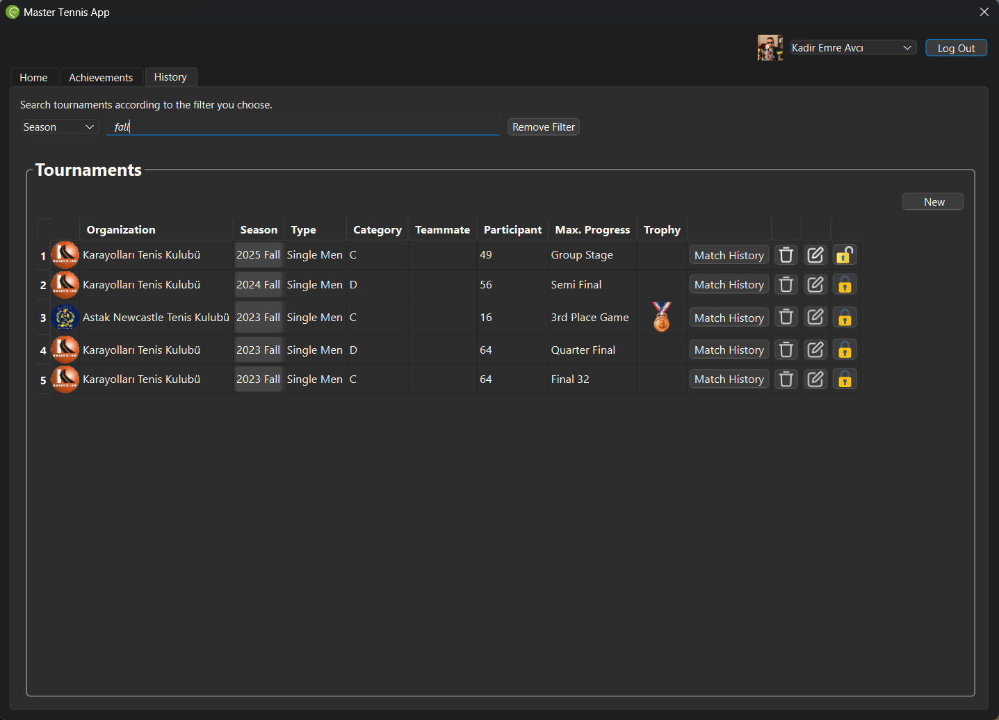

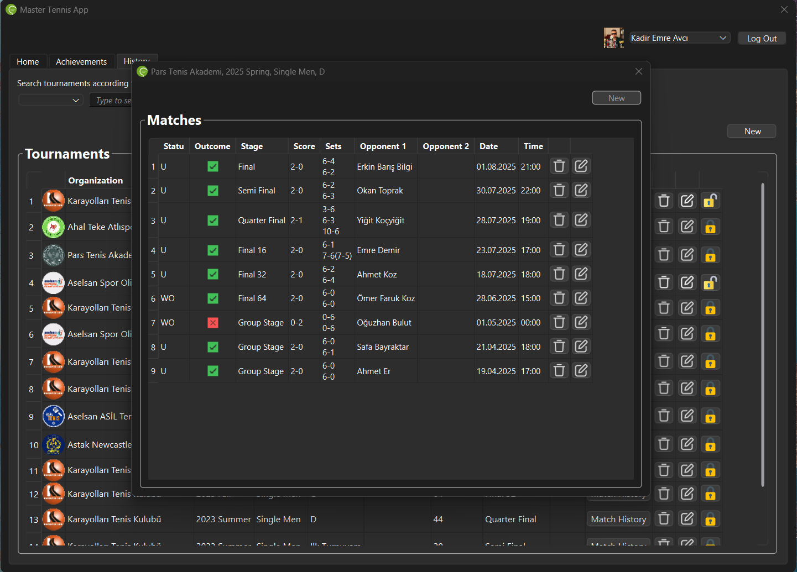

### Profile Switching

Switch to other profiles directly from your profile screen without returning to the welcome screen.

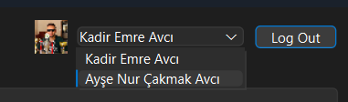

---

**To run the application:**  
- Execute `MasterTennisApp.exe` from either the `build/debug` or `build/release` folder, depending on your build configuration.

---

## Folder Structure

```
MasterTennisApp/
  .github
    workflows/
      CICD-windows.yml   # Sets up a Continuous Integration and Continuous Deployment (CI/CD) process on GitHub
  src/
    app/                # Core application logic, UI code related to Qt, and resource files
      resource/         # UI resource files, including:
        profiles/       # Images for user profiles
        organizations/  # Images for organizations
    business_logic/     # Core business logic (independent of Qt components)
    utility/            # Helper functions for custom Qt components and STL
  database/             # Application database file
  extern/               # External dependencies (e.g., Googletest repository)
    googletest/
  test/                 # Unit test code for business logic
  docs/
    screenshots/        # Screenshots of the application
  README.md             # Project README file
  CMakeLists.txt        # Main CMake project configuration
  .gitignore            # Git ignore rules for files and directories
```

> **Note:** The workflow file under `.github/workflows/cicd-windows.yml` automates both continuous integration (CI) and continuous deployment (CD) steps, covering build, analysis, and test phases on Windows.

---

## License

This project is licensed under the MIT License.  

---

## Contact

Created by [Kadir Emre AVCI](https://github.com/KadirEmreAVCI)  
For questions or feedback, open an issue or contact me directly.
